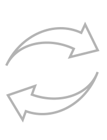

<!-- Improved compatibility of back to top link: See: https://github.com/GITHUBNAME/PROJECTNAME/pull/73 -->
<a name="readme-top"></a>

[![Contributors][contributors-shield]][contributors-url]
[![Forks][forks-shield]][forks-url]
[![Stargazers][stars-shield]][stars-url]
[![Issues][issues-shield]][issues-url]
[![MIT License][license-shield]][license-url]
[![LinkedIn][linkedin-shield]][linkedin-url]


<!-- PROJECT LOGO -->
<br />
<div align="center">
  <a href="https://github.com/GITHUBNAME/PROJECTNAME">
    
  </a>

  <h3 align="center"> PROJECTNAME </h3>

  <p align="center" style="font-weight: bold;">
    IAAC: AI in Urbanism 2022-23
    <br />
    <a href="https://colab.research.google.com/github/GITHUBNAME/PROJECTNAME/blob/main/src/NOTEBOOKNAME.ipynb">View Demo</a>
    ·
    <a href="https://github.com/GITHUBNAME/PROJECTNAME/issues">Report Bug</a>
    ·
    <a href="https://github.com/GITHUBNAME/PROJECTNAME/issues">Request Feature</a>
  </p>
</div>


<!-- TABLE OF CONTENTS -->
<details>
  <summary>Table of Contents</summary>
  <ol>
    <li>
      <a href="#about-the-project">About The Project</a>
      <ul>
      <li><a href="#intro">Intro</a></li>
        <li><a href="#built-with">Built With</a></li>
      </ul>
    </li>
    <li>
      <a href="#getting-started">Getting Started</a>
      <ul>
        <li><a href="#prerequisites">Prerequisites</a></li>
        <li><a href="#usage">Usage</a></li>
      </ul>
    </li>
    <li><a href="#challenges">Challenges</a></li>
    <li><a href="#future-work">Future work</a></li>
    <li><a href="#license">License</a></li>
    <li><a href="#contact">Contact</a></li>
    <li><a href="#acknowledgements">Acknowledgements</a></li>
    <li><a href="#more-acknowledgements">More acknowledgements</a></li>
  </ol>
</details>


<!-- ABOUT THE PROJECT -->
## About The Project


Project developed under the course AI in Urbanism 2022-23 in [IAAC](https://iaac.net/).

__Description:__ one sentence description of the project containing why, what, how (where and for whom) \
 __Problem statement:__ which problem the project solves, _why_ you are doing it. \
 __Idea:__ _what_ you are doing to solve the problem \
 __Solution:__ _how_ you are solving the problem, the method \
 __Place:__ _where_ \
 __Beneficiaries:__ the users of the project, _who_ will benefit from it.


### Intro

A longer description of the project, not more than 150 words.

<p align="right">(<a href="#readme-top">back to top</a>)</p>


### Built With


* [python3](https://www.python.org/)
* [HTML](https://developer.mozilla.org/en-US/docs/Web/HTML)
* [sklearn](https://scikit-learn.org/stable/)
* [HuggingFace](https://huggingface.co/)
* [Pytorch](https://pytorch.org/)
* [Tensorflow](https://www.tensorflow.org/)
* [Mapbox](https://www.mapbox.com/)
* [GoogleStreetMaps](https://mapsplatform.google.com/)
* [Yelp](https://www.yelp.se/stockholm)
* [OpenAI API](https://openai.com/product)
* [Midjourney](https://midjourney.com/)
* [Stable Diffusion](https://stability.ai/blog/stable-diffusion-public-release)
* [Flask](https://flask.palletsprojects.com/en/2.3.x/)
* [FastAPI](https://fastapi.tiangolo.com/)
* [Colab](https://colab.research.google.com/)

<p align="right">(<a href="#readme-top">back to top</a>)</p>


<!-- GETTING STARTED -->
## Getting Started

<a href="https://colab.research.google.com/github/AUTHORNAME/PROJECTNAME/blob/main/src/NOTEBOOKNAME.ipynb" target="_parent"></a>\
alternatively clone the repo:
```
git clone https://github.com/AUTHORNAME/PROJECTNAME.git
```

### Prerequisites
None
<p align="right">(<a href="#readme-top">back to top</a>)</p>
<!-- USAGE EXAMPLES -->

### Usage

To use the project follow these steps:\
_Describe how to use your project (e.g. how to import the csv file you used, which cells to run to see which output, which packages to install, where to create an account (e.g. a token for chatgpt ?))_
* Step 1
* Step 2

<p align="right">(<a href="#readme-top">back to top</a>)</p>

## Challenges

While working on the project the following challenges were encountered:

_Describe which challenges you faced during the project (e.g. there's an issue with missing public facilities data in Beirut, instability of image generation from prompts etc.)_ 
* challenge 1
* challenge 2

<p align="right">(<a href="#readme-top">back to top</a>)</p>

## Future work

_Describe the potential improvements or developments of the project (e.g. deploy the project, add more cities, add support for some feature)._

- [x] step 1
- [ ] step 2
- [ ] step 3

<p align="right">(<a href="#readme-top">back to top</a>)</p>

<!-- LICENSE -->
## License

Distributed under the MIT License. See `LICENSE.txt` for more information.

<p align="right">(<a href="#readme-top">back to top</a>)</p>


## Contact

AUTHORNAME - [@AUTHORNAME](https://github.com/AUTHORNAME) - [e-mail](mailto:samplemail@gmail.com) - [LinkedIn][linkedin-url]

<p align="right">(<a href="#readme-top">back to top</a>)</p>


<!-- ACKNOWLEDGMENTS -->
## Acknowledgements
<div style="display:flex; flex:wrap; flex-direction: column; width:100%; justify-content:center; margin-top:30px">
    <div  style="display:flex; flex:wrap; flex-direction: column; width:60%; justify-content:left; margin-left:10px">
        <a href="https://iaac.net">
            
        </a>
    </div>
    <div style="display:flex; flex:wrap; justify-content:space-around; --w:100%">
        <div style="display:flex; flex:wrap; flex-direction: column; width:30%; justify-content:center; align-content:center;">
            <a href="https://www.linkedin.com/in/angeloschronis/">
            </a>
            <a href="https://www.linkedin.com/in/angeloschronis/"> Angelos Chronis </a>
        </div>
        <div style="display:flex; flex:wrap; flex-direction: column; width:30%; justify-content:center; ">
            <a href="https://www.linkedin.com/in/serjoscha-d%C3%BCring-920644173/">
            </a>
            <a href="https://www.linkedin.com/in/serjoscha-d%C3%BCring-920644173/"> Serjoscha Düring </a>
        </div>
        <div style="display:flex; flex:wrap; flex-direction: column; width:30%; justify-content:center;">
            <a href="https://www.linkedin.com/in/stanislava-fedorova/">
            </a>
            <a href="https://www.linkedin.com/in/stanislava-fedorova/"> Stasja Fedorova </a>
        </div>
    </div>
</div>

### More acknowledgements
* [Best README template](https://github.com/othneildrew/Best-README-Template)

<p align="right">(<a href="#readme-top">back to top</a>)</p>


<!-- MARKDOWN LINKS & IMAGES -->
<!-- https://www.markdownguide.org/basic-syntax/#reference-style-links -->
[contributors-shield]: https://img.shields.io/github/contributors/GITHUBNAME/PROJECTNAME.svg?style=for-the-badge
[contributors-url]: https://github.com/GITHUBNAME/PROJECTNAME/graphs/contributors
[forks-shield]: https://img.shields.io/github/forks/GITHUBNAME/PROJECTNAME.svg?style=for-the-badge
[forks-url]: https://github.com/GITHUBNAME/PROJECTNAME/network/members
[stars-shield]: https://img.shields.io/github/stars/GITHUBNAME/PROJECTNAME.svg?style=for-the-badge
[stars-url]: https://github.com/GITHUBNAME/PROJECTNAME/stargazers
[issues-shield]: https://img.shields.io/github/issues/GITHUBNAME/PROJECTNAME.svg?style=for-the-badge
[issues-url]: https://github.com/GITHUBNAME/PROJECTNAME/issues
[license-shield]: https://img.shields.io/github/license/GITHUBNAME/PROJECTNAME.svg?style=for-the-badge
[license-url]: https://github.com/GITHUBNAME/PROJECTNAME/blob/master/LICENSE.txt
[linkedin-shield]: https://img.shields.io/badge/-LinkedIn-black.svg?style=for-the-badge&logo=linkedin&colorB=555
[linkedin-url]: https://linkedin.com/in/stanislava-fedorova
[product-screenshot]: assets/screenshot.png


